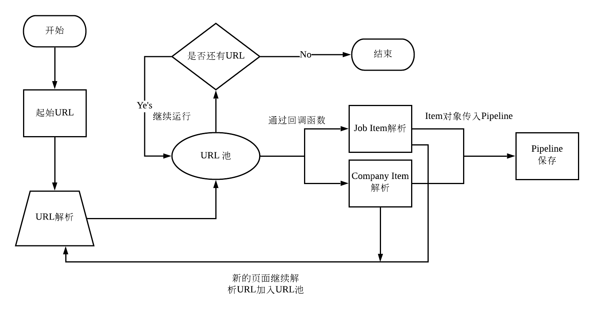

# 拉勾网全站抓取

##### 项目介绍：


**** 
### 项目逻辑

(点击查看大图)

注意：
页面中的所有url会根据规则自动获取，并不需要手动调用 requests函数写入回调函数。所有符合规则的页面会自动进入回调函数分析或直接分析页面内的url，分析后把页面丢弃，新的url加入url池。

**** 
### 项目技术栈
`Scrapy`,`Scrapy crawl`  

####开始
通过以下代码创建新爬虫，使用crawl模板
 ```scrapy genspider -t crawl lagou www.lagou.com```


#### 技术

使用scraoy中的 crwal模板，通过定义全局的规则自动解析URL并传递给对应回调函数。函数只需要负责收集item信息并yiel item进入pipeline，不再需要解析url。

##### 代码
```python
    name = 'lagou'
    allowed_domains = ['lagou.com']
    start_urls = ['http://www.lagou.com/']

    rules = (
        Rule(LinkExtractor(allow=r'zhaopin/.*'),follow=True),
        Rule(LinkExtractor(allow=r'gongsi/j\d+.html'), callback='parse_company', follow=True),
        Rule(LinkExtractor(allow=r'jobs/d+.html'), callback='parse_jobs', follow=True),
    )
    
```
**** 


****  
### 抓取内容

#### 职位
|字段|
|---|
|---|
|---|
|---|
|---|


****  
### 运行截图
#### 当redis内没有任何URL时必须使用下面命令添加 start_urls
```
lpush lagou:start_urls https://www.lagou.com/
```


#### 运行截图
#### scrapy会把获取的数据用log的形式打印出来


#### 抓取结果（csv文件会保存在当前文件夹下）


