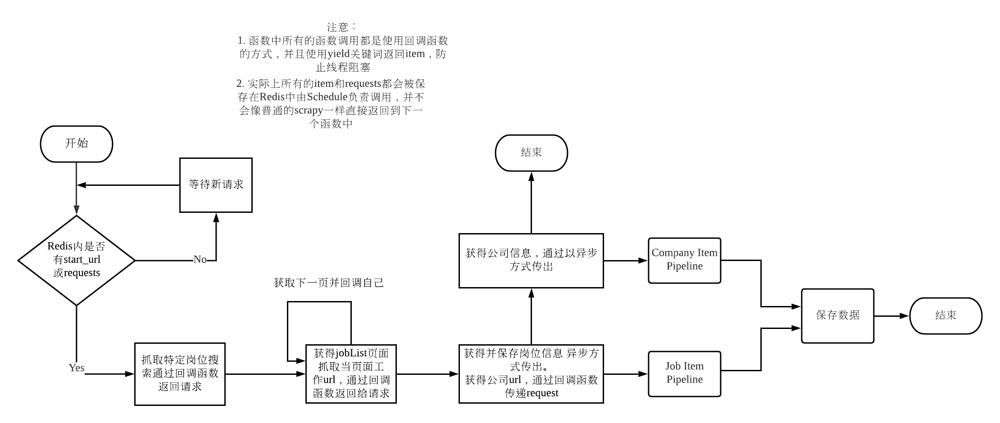
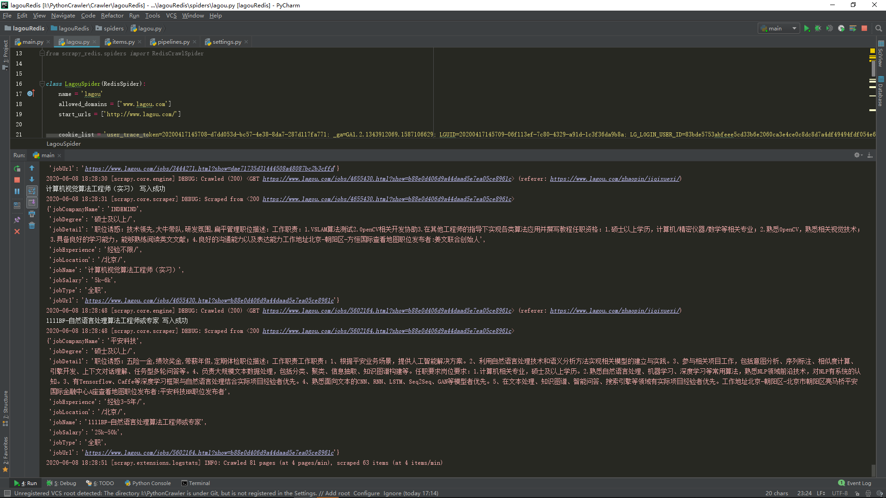
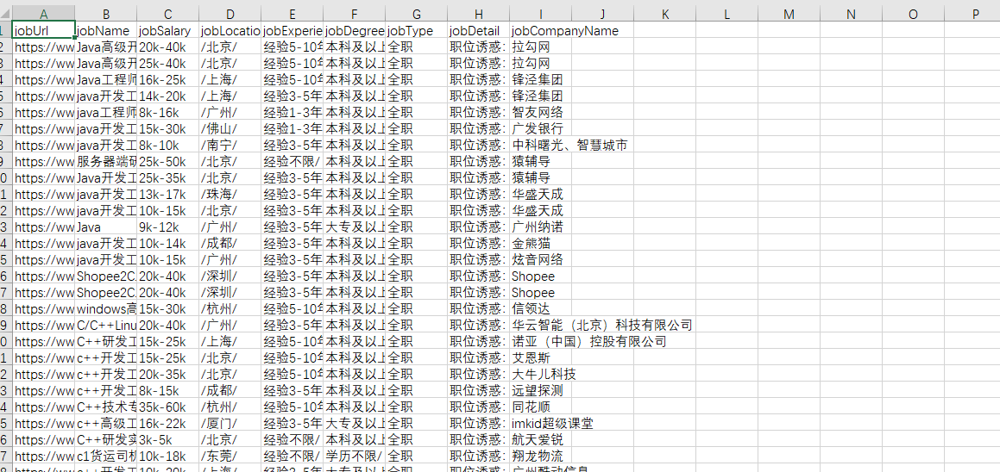

# 拉勾网职位/公司抓取

##### 项目介绍：
通过Scrapy抓取拉勾网的职位和公司，Scrapy是一个基于协程的异步框架，所以效率非常的高。同时必须要限速，否则IP极易被封。

**** 
### 项目逻辑



**** 
### 项目技术栈
`Scrapy-Reids`,`Redis`,`Requests`


#### 使用 setting内参数进行反爬

`AUTOTHROTTLE_ENABLED` ：一个根据算法自动限速的框架，对网页更加友好，防止在短时间内发起大量http请求导致服务器压力增大或者ip地址被封。  
来源：https://docs.scrapy.org/en/0.24/topics/autothrottle.html
  
`COOKIES_ENABLED`：是否携带 setting内的的cookies，如果打开每次就会带上相同的cookies，因为拉勾网不需要登陆所以每次请求应该携带上次response的cookies。每次携带相同的cookies极易被识别为爬虫，选择False。  
来源：https://docs.scrapy.org/en/0.24/topics/downloader-middleware.html?highlight=cookies_enable#std:setting-COOKIES_ENABLED

`DOWNLOAD_DELAY`:下载延迟，不设置IP极易被封  
  
`RANDOMIZE_DOWNLOAD_DELAY`:  随机延迟，设定后延迟会取 0.5*DOWNLOAD_DELAY 到 1.5*DOWNLOAD_DELAY中的一个随机值，防止网站通过请求特征反爬（例：恰好每30秒访问一次极易被识别为爬虫特征）

##### 代码
```python
 custom_settings = {
        "COOKIES_ENABLED": False,
        "AUTOTHROTTLE_ENABLED": True,
        "DOWNLOAD_DELAY": 15,
        "RANDOMIZE_DOWNLOAD_DELAY":True,
        }
```

****  
### 抓取内容
#### 职位
|字段|
|---|
|网页URL|
|岗位名|
|薪资|
|工作地址|
|需要经验|
|学历要求|
|岗位类型|
|岗位详细信息|
|公司名|

#### 公司
|字段|
|---|
|公司URL|
|公司名(显示)|
|公司名(实际)|
|简历回复率|
|简历回复平均时间|
|面试评价个数|
|最后的登录时间|
|公司规模|
|公司地址|
|公司简介|

****  
### 运行截图




