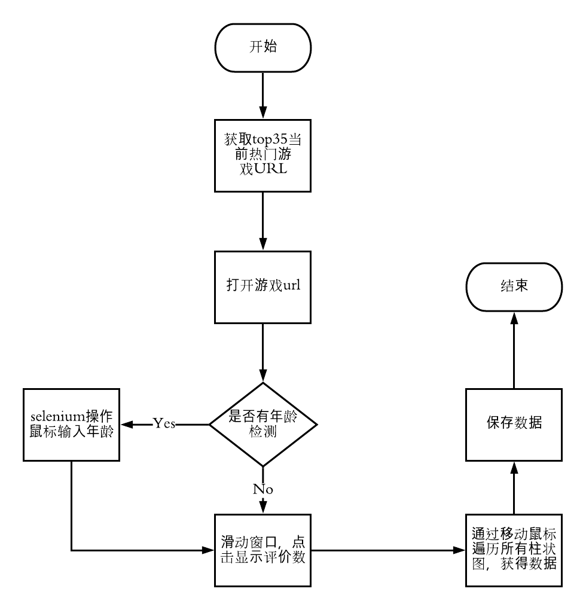
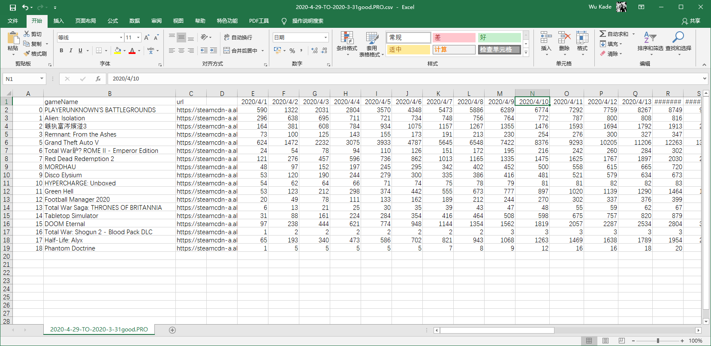

# steam热榜游戏好评/差评数量抓取

##### 项目介绍：
使用 selenium 抓取热门游戏的好评差评数，因为没有steam api，没有展示好评和差评数量的游戏无法获取到数据

**** 
### 项目逻辑

(点击查看大图)

**** 
### 项目技术栈
`selenium`,`requests`

#### 技术
使用 selenium通过检测，抓取canvas标签内的内容

****  
### 抓取内容

#### 抓取结果（csv文件会保存在当前文件夹下）

