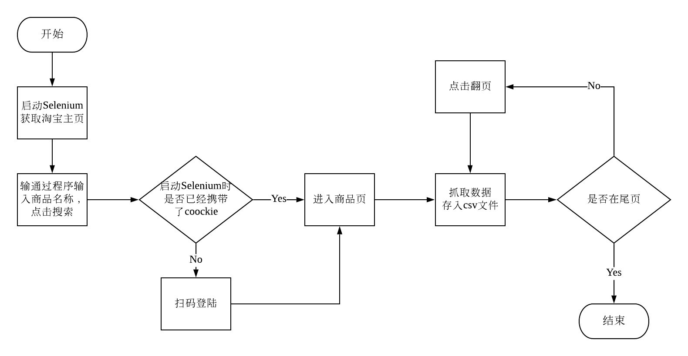
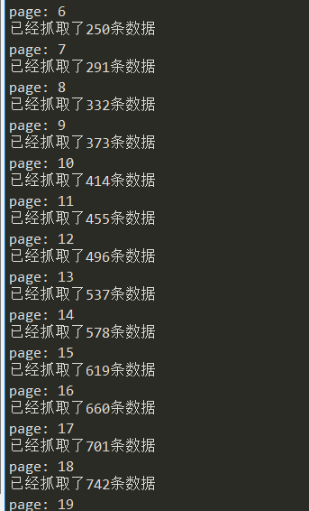
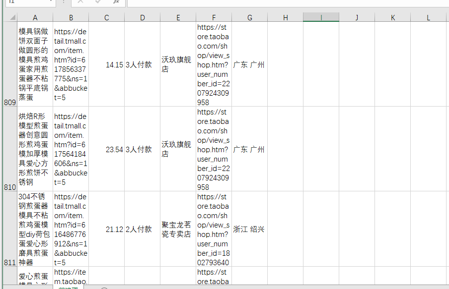

# 淘宝网商品抓取

##### 项目介绍：
淘宝网商品抓取，只需要输入需要抓取的商品名就可以自动抓取数据。通过selenium进行反爬，当前目录下的csv文件就是抓取到的原始数据。

**** 
### 项目逻辑



**** 
### 项目技术栈
`selenium`
#### 使用 option 关闭 selenium 的top bar实现反爬
```python

    options = Options()
    url = 'https://www.taobao.com/'
    options.add_experimental_option('excludeSwitches', ['enable-automation'])
    browser = webdriver.Chrome('./chromedriver.exe',options=options)
```

#### 通过修改设备识别进行反爬
```python

  options = Options()
  mobile_emulation = {"deviceName": "iPhone X"}
  options.add_experimental_option("mobileEmulation", mobile_emulation)
  browser = webdriver.Chrome('./chromedriver.exe',options=options)
```

****  
### 抓取内容

|字段|
|---|
|商品名|
|商品链接|
|商品价格|
|本月销量|
|店铺名|
|店铺链接|
|发货地|

### 运行截图




