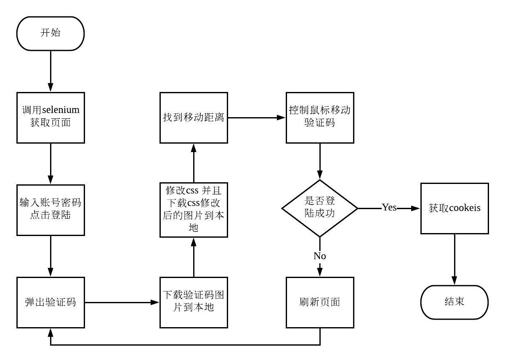

# bilibili登陆滑拼图动验证码突破
因为抓取b站部分信息需要登陆，所以最好使用单独的登陆逻辑获取coockie并放入cookie池内解决数据抓取问题。
这个项目就是用来登陆b站用的

##### 项目介绍：
b站登陆的时候使用了滑动验证码，该项目可以破解滑动验证码并且成功登陆b站，登陆成功后便可以获取的cookie然后进行更进一步的抓取。


**** 
### 项目逻辑



**** 
### 分析

观察css可以发现，图片的缺口实际上是css渲染导致的，我们可以标签中的style去掉试试。  


图片的缺口果然不见了

由图可以看到，滑动拼图验证码由两部分组成，一部分是缺失某块的图片，一部分是本来的图片。只需要找到两个图片之间的不同的地方，再找出这个地方的x坐标，就能找到需要滑动的距离。


**** 

#### 技术栈
`selenium`,`ActionChains`,`PIL`


##### 代码
使用browser执行js脚本，修改元素的style
```python
browser.execute_script('document.querySelectorAll("canvas")[3].style=""')
```
**** 

对比两个像素的RGB值，判断是否相同，用于找到缺口位置
```python
    def compare_pixel(self,image1,image2,x,y):
        #判断两个像素是否相同
        pixel1 = image1.load()[x,y]
        pixel2 = image2.load()[x,y]

        threshold = 60
        if abs(pixel1[0]-pixel2[0]) < threshold and abs(pixel1[1]-pixel2[1]) < threshold and abs(pixel1[2]-pixel2[2]) < threshold:
            return True
        else:
            return False
```
**** 
使用 PIL中的 Image函数打开图片，遍历像素

```python
def compare(self):

        capture1 = Image.open('./before.png')
        capture2 = Image.open('./after.png')

        #获取缺口位置
        left = 60
        has_find = False
        for i in range(60,capture1.size[0]):
            if has_find:
                break
            for j in range(capture1.size[1]):
                if not self.compare_pixel(capture1,capture2,i,j):
                    left = i
                    has_find = True
                    break
        left -= 6
        return left
```


