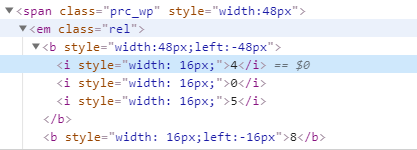
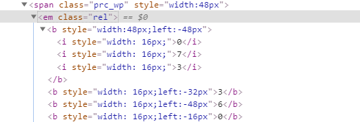
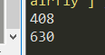

# 去哪网css偏移反爬

##### 项目介绍：
去哪网的票价实际上是做了反爬处理的，项目会破解去哪网的css偏移反爬


**** 
### 项目逻辑
根据分析，数字分为上下两层，上层数字会根据偏移量覆盖不同的下层数字并且组合成用户所看到的数字。

**** 
### 分析
网页上所显示的票价是408


打开调试窗看到的tag发现并不是408，而是四个数字，405，8
可以发现这其中的规律，8的left是-16px，如果8把405中的5覆盖就能得到用户所看到的票价，408/


**** 
网页上所显示的票价是630


打开调试窗看到的tag看到的是073，360，并且360三个数字的css分别做了不同的偏移。


**** 

#### 技术栈
`parsel`,`Selector`

##### 代码
使用上方两个库和Python还原字符串

```python
def get_price(content):
    for price in content.xpath('//em[@class="rel"]'):
        backNums = []
        frontDict = {}
        #获取底层
        back = price.xpath('.//b[1]/i')
        
        #获取上层
        front = price.xpath('.//b')[1:]
        
        #获取底层数字，放入list
        for iTag in back:
            backNums.append(iTag.xpath('./text()').extract_first())
            
        #get left offset and number put in dict
        for bTag in front:
            left = int(bTag.xpath('./@style').extract_first().split(';')[1][5:-2])
            num = bTag.xpath('./text()').extract_first()
            frontDict[int(left/16)] = num
        
        #restore the real price
        for index,val in frontDict.items():
            backNums[index] = val
        print(''.join(backNums))
```
**** 
结果，数字成功还原。

