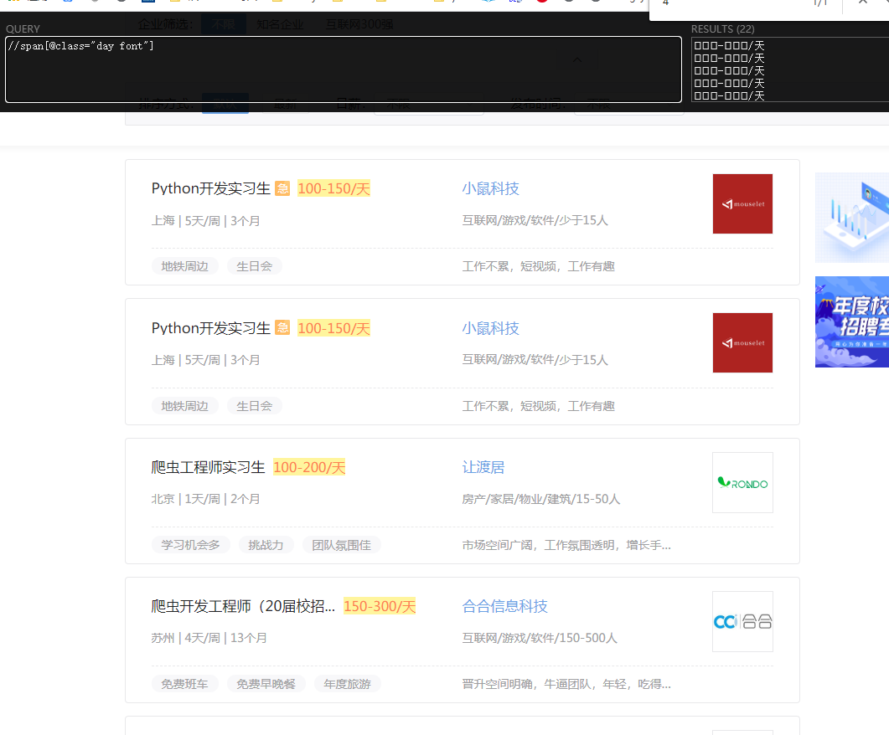
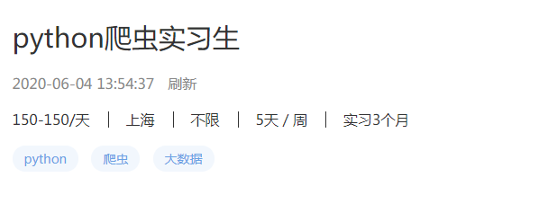
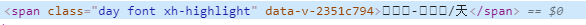
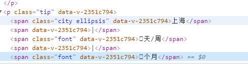
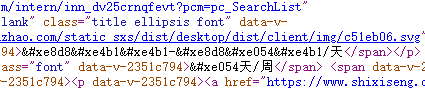
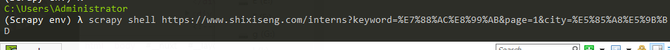
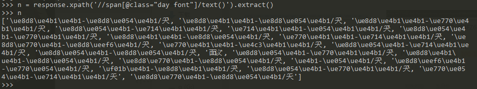
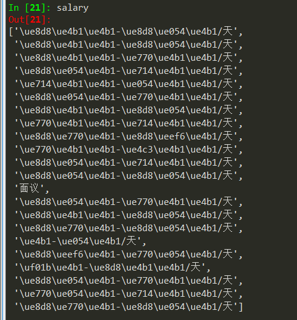
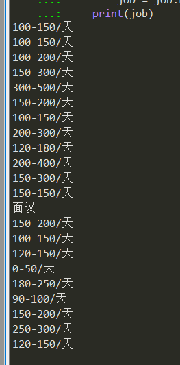

# bilibili登陆滑拼图动验证码突破
##### 项目介绍：
因为抓取b站部分信息需要登陆，所以最好使用单独的登陆逻辑获取coockie并放入cookie池内解决数据抓取问题。
这个项目就是用来登陆b站用的

b站登陆的时候使用了滑动验证码，该项目可以破解滑动验证码并且成功登陆b站，登陆成功后便可以获取的cookie然后进行更进一步的抓取。


**** 
### 分析

  
#### 尝试使用xpath获取页面内的所有日薪，发现都是小框
**** 
    
#### 页面内容
**** 
    
#### 发现标签里的数字都是小框
**** 
  
#### 发现数字都是小框，下一步点开源码看看是什么
**** 
  
#### 源码都是一种特殊编码，并不是 UTF-8 或者 GKB之类的编码
**** 
  
#### 打开scrapy shell进行调试
**** 
  
#### 明显可以看出来，看到是0的数字在这里就是`\ue4b1`  
#### 说明这是一种特殊的编码
**** 
  
#### 获取日薪，全是这种特殊编码

****   

#### 分析：
既然这种特殊的编码是一种映射，只需要找到编码所对应的数字在进行反向映射就能得到原来的数字了。
先手写字典，也可以用脚本获得字典，然后用字典把编码映射回数字。

**** 


##### 代码

```python
url = 'https://www.shixiseng.com/interns?keyword=%E7%88%AC%E8%99%AB&page=1&city=%E5%85%A8%E5%9B%BD'
response = requests.get(url)
content = etree.HTML(response.text)

#get texts
salary = content.xpath('//span[@class="day font"]/text()')
for job in salary:
    
    #replace encrypt number to number
    for key,val in wordDict.items():
        job = job.replace(key,val)
    print(job)


```
**** 
#### 结果
破解反爬成功



