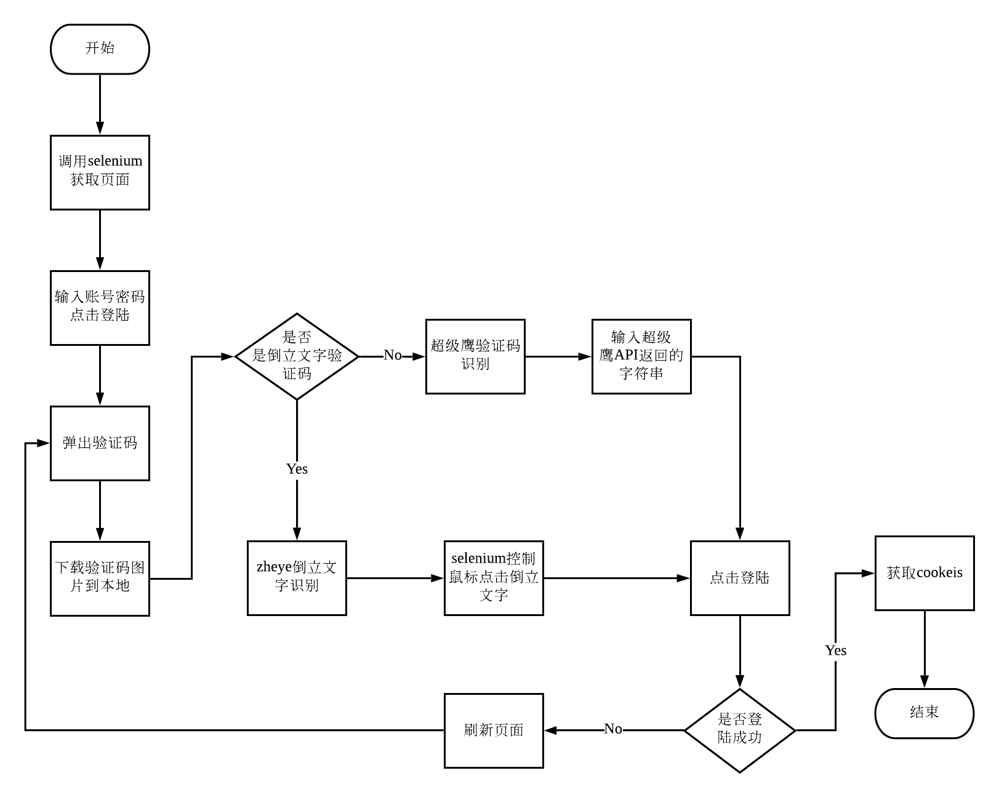

# 知乎倒立文字英文验证码突破
##### 项目介绍：


**** 
### 项目逻辑
  


**** 
### 分析
  

**** 


**** 

#### 技术栈
`selenium`,`ActionChains`,`PIL`


##### 代码
使用browser执行js脚本，修改元素的style
```python
browser.execute_script('document.querySelectorAll("canvas")[3].style=""')
```
**** 

对比两个像素的RGB值，判断是否相同，用于找到缺口位置
```python

```
**** 


```python

```
****

## 注意：
必须要修改 selenium默认鼠标移动速度，否则会非常的慢


